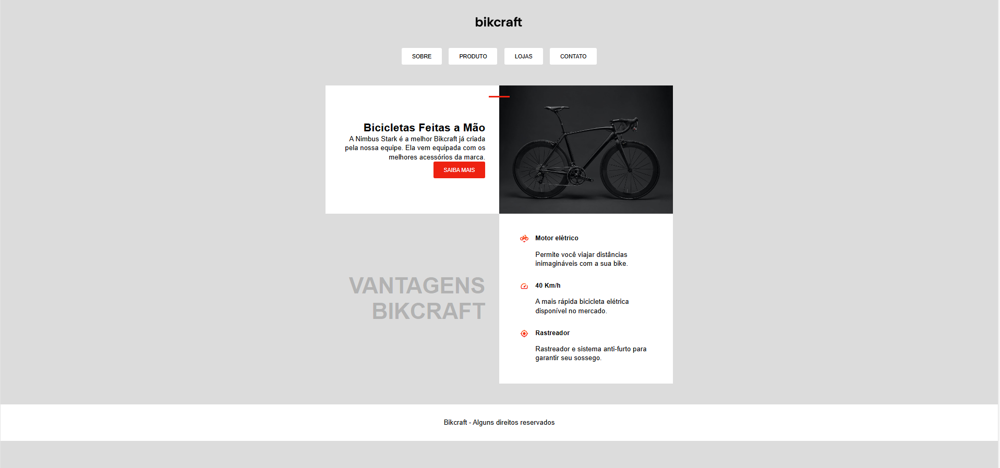

1 - Download de imagens em alta resolução para uso em projetos -
https://unsplash.com/pt-br/fotografias/motocicleta-preta-e-laranja-eeTJKC_wz34

2 - Redimensiona imagens para melhor aplicação - https://squoosh.app

3 - Ajuda a entender sobre posicionamento e alinhamento
https://origamid.com/projetos/grid

4 - Transforma pequenos vídeos em gif

## Modelo Conceitual

